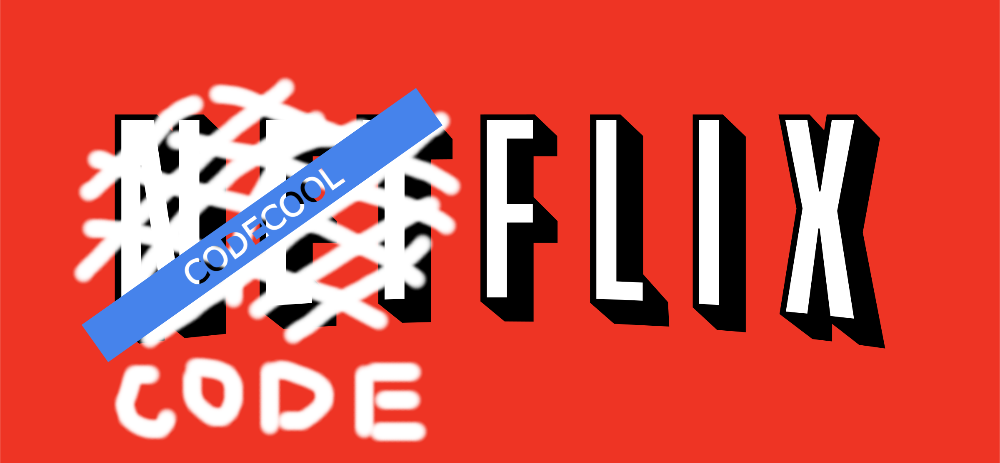

<!--
*** Thanks for checking out the Best-README-Template. If you have a suggestion
*** that would make this better, please fork the repo and create a pull request
*** or simply open an issue with the tag "enhancement".
*** Thanks again! Now go create something AMAZING! :D
-->


<!-- PROJECT SHIELDS -->
<!--
*** I'm using markdown "reference style" links for readability.
*** Reference links are enclosed in brackets [ ] instead of parentheses ( ).
*** See the bottom of this document for the declaration of the reference variables
*** for contributors-url, forks-url, etc. This is an optional, concise syntax you may use.
*** https://www.markdownguide.org/basic-syntax/#reference-style-links
-->
[![Contributors][contributors-shield]][contributors-url]
[![Forks][forks-shield]][forks-url]
[![Stargazers][stars-shield]][stars-url]
[![Issues][issues-shield]][issues-url]
[![LinkedIn - Marius][linkedin-marius-shield]][linkedin-marius-url]
[![Github - Marius][github-marius-shield]][github-marius-url]
[![LinkedIn - Marius][linkedin-razvan-shield]][linkedin-razvan-url]
[![Github - Razvan][github-razvan-shield]][github-razvan-url]


<!-- PROJECT LOGO -->
<br />
<p align="center">
  <a href="https://github.com/rgrigore/Codeflix.git">
    
  </a>

<h3 align="center">Dungeon Crawl</h3>

  <p align="center">
    An awesome PC roguelike game!
    <br />
    <a href="https://github.com/rgrigore/Codeflix.git"><strong>Explore the docs »</strong></a>
    <br />
    <br />
    <a href="https://github.com/rgrigore/Codeflix">View Demo</a>
    ·
    <a href="https://github.com/rgrigore/Codeflix/issues">Report Bug</a>
    ·
    <a href="https://github.com/rgrigore/Codeflix/issues">Request Feature</a>
  </p>


<!-- TABLE OF CONTENTS -->
<details open="open">
  <summary>Table of Contents</summary>
  <ol>
    <li>
      <a href="#about-the-project">About The Project</a>
      <ul>
        <li><a href="#built-with">Built With</a></li>
      </ul>
    </li>
    <li>
      <a href="#getting-started">Getting Started</a>
      <ul>
        <li><a href="#prerequisites">Prerequisites</a></li>
        <li><a href="#installation">Installation</a></li>
      </ul>
    </li>
    <li><a href="#usage">Usage</a></li>
    <li><a href="#roadmap">Roadmap</a></li>
    <li><a href="#contributing">Contributing</a></li>
    <li><a href="#contact">Contact</a></li>
    <li><a href="#acknowledgements">Acknowledgements</a></li>
  </ol>
</details>


<!-- ABOUT THE PROJECT -->
## About The Project

This is an exciting roguelike strategy game for all the fans out there, like the classic version that started in the 70’s and on.

Here's why:
* You are the main hero of the story.
* The main hero has to face enemies as Skeleton and Ghosts. 
* The game is not turn based, so the enemies move individually and even chase the main hero.
* Enemies can be defeated by direct battle.
* There are 2 maps that the hero has to complete in order to reach the endpoint and win.
* Keep in mind that there are items to collect in order to boost you up, but some are dangerous, and the hero should avoid in order not to create damage.

### Built With

#### Backend
* [Spring Boot](https://spring.io/projects/spring-boot)
* [Spring Cloud Netflix (Eureka, Zuul)](https://spring.io/projects/spring-cloud-netflix)
* [Lombok](https://projectlombok.org/)
* [H2 DataBase](https://www.h2database.com/html/main.html)

#### Frontend
* [React](https://reactjs.org/)
* [React-Bootstrap](https://react-bootstrap.github.io/)
* [npm](https://www.npmjs.com/)

#### Version control
* [Github](https://www.gtihub.com/)

#### Project Management
* [Jira Software](https://www.atlassian.com/software/jira?&aceid=&adposition=&adgroup=89541897982&campaign=9124878150&creative=415542514747&device=c&keyword=jira&matchtype=e&network=g&placement=&ds_kids=p51242161283&ds_e=GOOGLE&ds_eid=700000001558501&ds_e1=GOOGLE&gclid=Cj0KCQiAnKeCBhDPARIsAFDTLTIUjm6m9LQssN_d15V_dYNqPiWaS_df09mdcnHPj-QkqTKrZfAjB6kaAhdEEALw_wcB&gclsrc=aw.ds)


<!-- GETTING STARTED -->
## Getting Started

This application can be tested by installing all prerequisites, clone the repo, build the project from pom.xml, run the app and enjoy!

### Prerequisites

All prerequisites must be installed, accordingly to the technologies used in this project:

### Installation

* Backend

1. Clone the repo
   ```sh
   git clone https://github.com/rgrigore/Codeflix.git
   ```
2. Build and run each module starting with service-registry.

3. Install NPM packages in frontend.
   ```sh
   cd frontend
   npm install
   ```
   
4. Run the frontend.
   ```sh
   npm start
   ```

<!-- USAGE EXAMPLES -->
## Usage

Further we will shortly name, describe and visualize some main features of the app.

### Placeholder section
* Placeholder instruction

[![placeholder image][register-png]]()

<!-- ROADMAP -->
## Roadmap

The project development took place through 1 Agile iterations taking 4 days, and presenting the results in the 5th.

[![agile][agile]]()

<!-- CONTRIBUTING -->
## Contributing

Contributions are what make the open source community such an amazing place to be learn, inspire, and create. Any contributions you make are **greatly appreciated**.

1. Fork the Project
2. Create your Feature Branch (`git checkout -b feature/AmazingFeature`)
3. Commit your Changes (`git commit -m 'Add some AmazingFeature'`)
4. Push to the Branch (`git push origin feature/AmazingFeature`)
5. Open a Pull Request


<!-- CONTACT -->
## Contact

Marius Ceobanu - [@My Github](https://github.com/marius-ceobanu) [@My LinkedIn](https://www.linkedin.com/in/marius-ciprian-ceobanu-3431157b) - ceobanu.marius@gmail.com

Razvan Grigore - [@My Github](https://github.com/rgrigore) [@My Linkedin](https://www.linkedin.com/in/razvan-grigore-978751157) - razvang95@gmail.com


<!-- ACKNOWLEDGEMENTS -->
## Acknowledgements
* [Software testing](/pages/general/software-testing)
* [Positive or negative](https://stackoverflow.com/questions/8162423)
* [How to design classes](/pages/java/how-to-design-classes)
* [Introduction to jdbc](/pages/java/introduction-to-jdbc)
* [jdbc basics](https://docs.oracle.com/javase/tutorial/jdbc/basics/index.html)
* [DAO pattern in Java](https://www.baeldung.com/java-dao-pattern)
* [Serialization in Java](/pages/java/serialization-in-java)
* [Compare two popular serialization framwork](https://www.baeldung.com/jackson-vs-gson)
* [1-Bit Pack by Kenney - Graphic Tiles](https://kenney.nl/assets/bit-pack)
* [CC0 1.0 Universal license](https://creativecommons.org/publicdomain/zero/1.0/)
* [Codecool Romania :thumbsup:](https://codecool.com/ro/)
* [Img Shields](https://shields.io)


<!-- MARKDOWN LINKS & IMAGES -->
<!-- https://www.markdownguide.org/basic-syntax/#reference-style-links -->
[contributors-shield]: https://img.shields.io/badge/Contributers-2-brightgreen
[contributors-url]: https://github.com/rgrigore/Codeflix/graphs/contributors
[forks-shield]: https://img.shields.io/badge/Forks-0-blue
[forks-url]: https://github.com/rgrigore/Codeflix/network/members
[stars-shield]: https://img.shields.io/badge/Stars-2-blue
[stars-url]: https://github.com/rgrigore/Codeflix/stargazers
[issues-shield]: https://img.shields.io/github/issues/rgrigore/Codeflix
[issues-url]: https://github.com/rgrigore/Codeflix/issues
[linkedin-marius-shield]: https://img.shields.io/twitter/url?label=Linkedin%20-%20Marius&logo=LINKEDIN&style=social&url=https%3A%2F%2Fwww.linkedin.com%2Fin%2Fmarius-ciprian-ceobanu-3431157b
[linkedin-marius-url]: https://www.linkedin.com/in/marius-ciprian-ceobanu-3431157b
[github-marius-shield]: https://img.shields.io/twitter/url?label=GitHub%20-%20Marius&logo=Github&style=social&url=https%3A%2F%2Fgithub.com%2Fmarius-ceobanu
[github-marius-url]: https://github.com/marius-ceobanu
[github-razvan-shield]: https://img.shields.io/twitter/url?label=GitHub%20-%20Razvan&logo=Github&style=social&url=https%3A%2F%2Fgithub.com%2Frgrigore
[github-razvan-url]: https://github.com/rgrigore
[linkedin-razvan-shield]: https://img.shields.io/twitter/url?label=Linkedin%20-%20Razvan&logo=LINKEDIN&style=social&url=https%3A%2F%2Fwww.linkedin.com%2Fin%2Frazvan-grigore-978751157
[linkedin-razvan-url]: https://www.linkedin.com/in/razvan-grigore-978751157
<!-- IMAGES -->
[register-png]: readme-graphics/register.png
[agile]: readme-graphics/agile-logo.png
